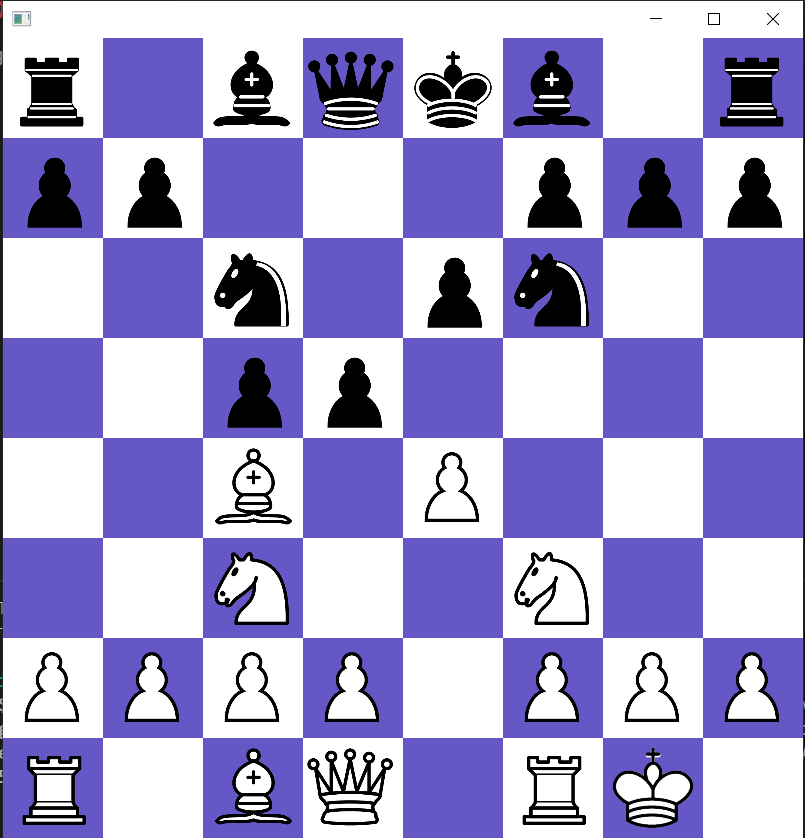
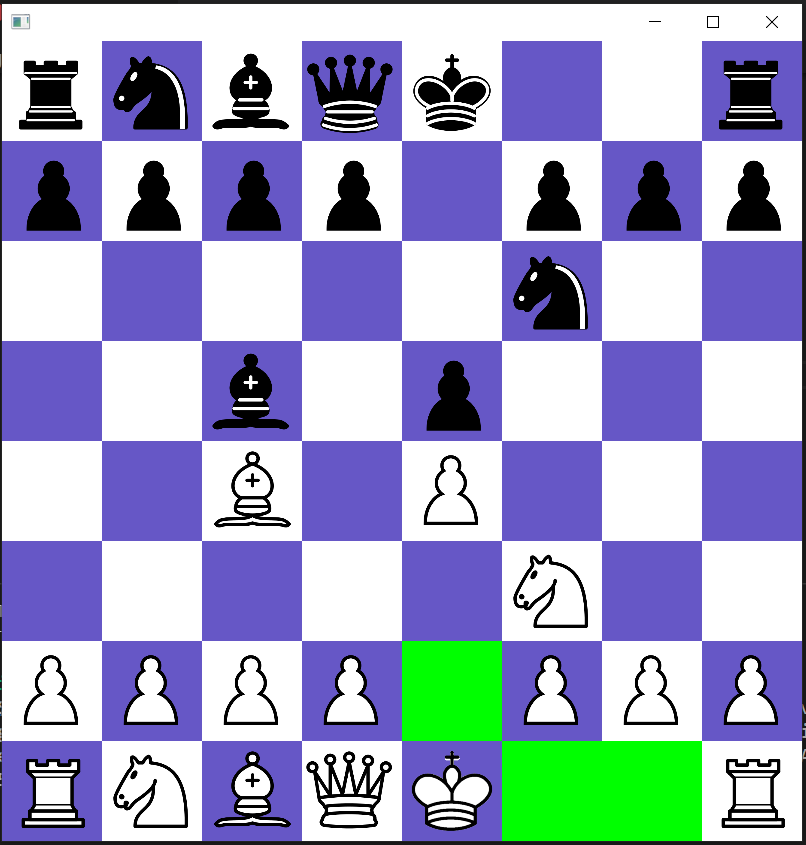
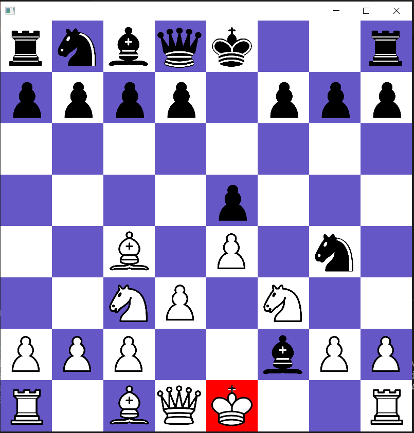
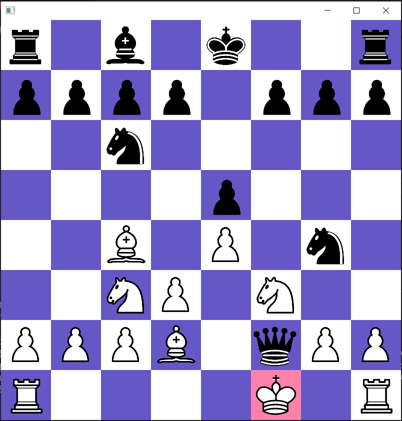

🙿🙿🙿
# Chess

A human vs human player chess program written in Java and JavaFX. Features a graphical user interface (GUI) for playing moves.

## User Features
1. Highlighting piece moves when piece is clicked
2. Highlighting king when in check/checkmate
3. Check detection
4. Castling
5. Pawn promotion to queen

## Program Design
1. Object Oriented Design of pieces. 
    - Used inheritance for pieces (classes for knights, bishops, etc extend from a Piece class)
2. MVC architecture for chessboard (BoardModel, BoardView, BoardController)
    - BoardModel tracks the locations of all board pieces.
    - BoardView tracks the locations of all image representations of the board pieces.
    - BoardController communicates between the model and view and ties them together.
3. JUnit Testing using inner classes approach
    - Individual tests aim to be as small as possible.
    - Inner classes are used to group elements of testing.

## GUI Screenshots
| Normal Position | Castling Moves | Check | Checkmate |
| ------------- | ------------- | ------------- | ------------- |
|  |  |  |  |
