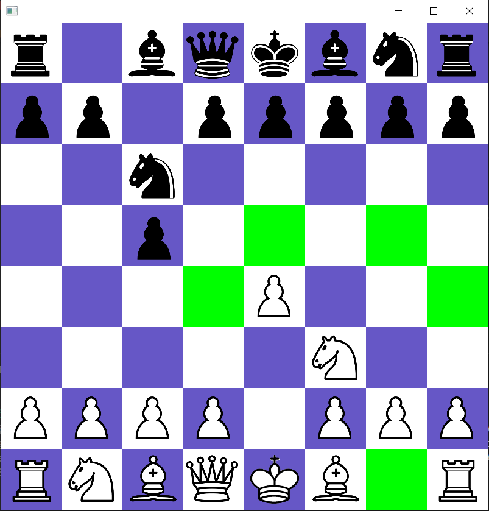
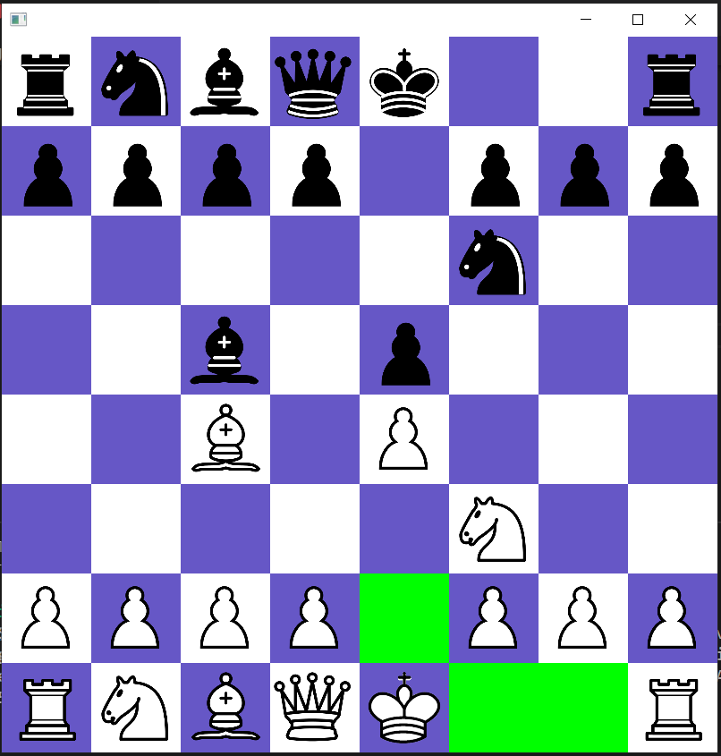
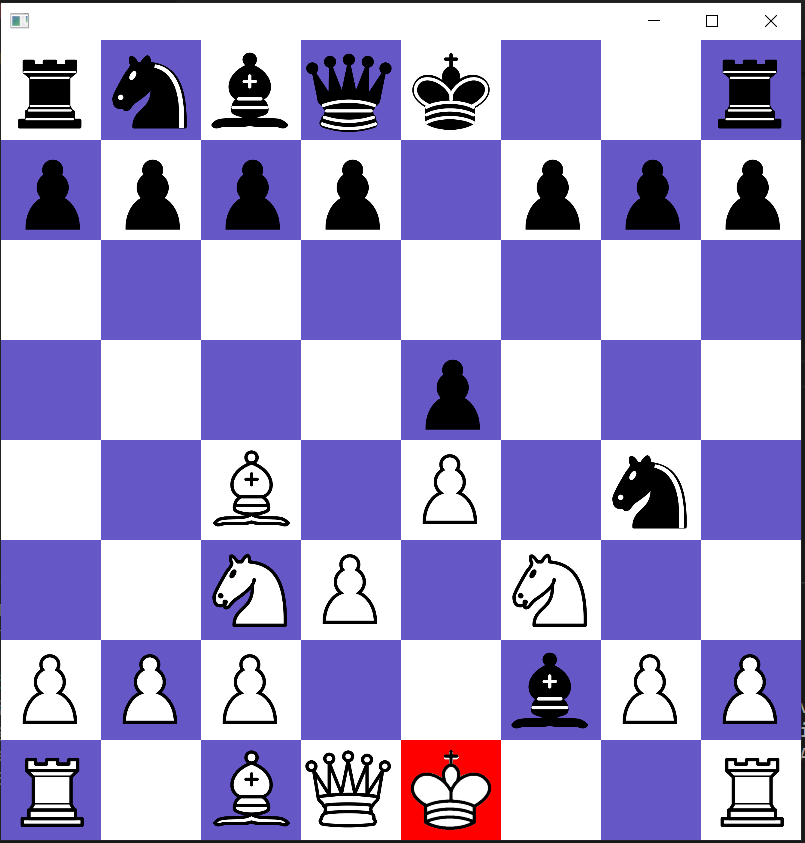
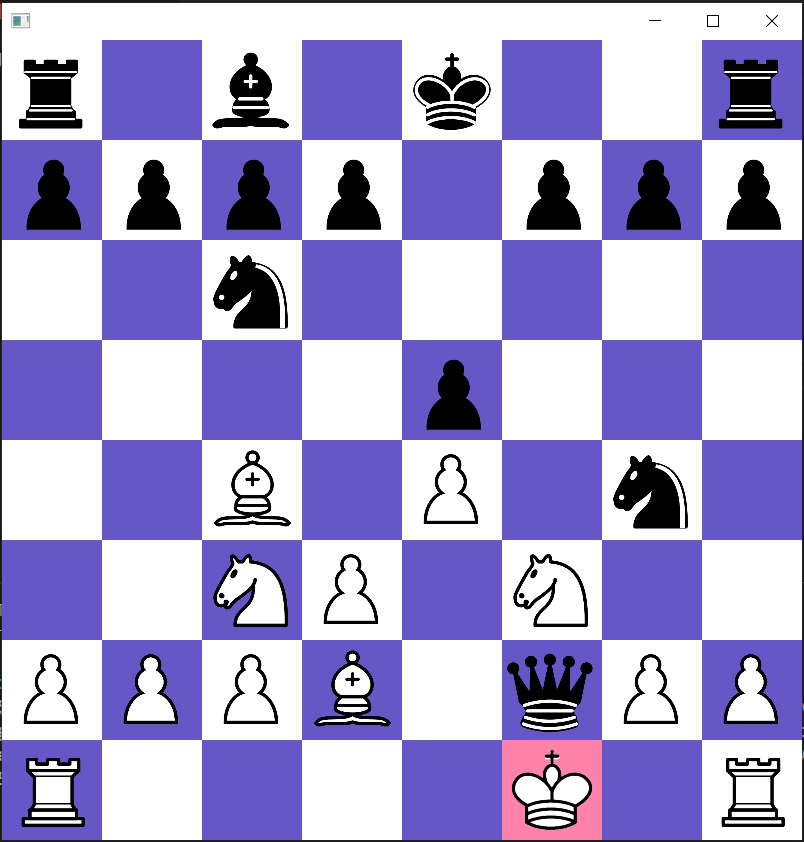

🙿🙿🙿🙿🙿🙿🙿🙿🙿🙿🙿🙿🙿🙿🙿🙿🙿🙿🙿🙿🙿🙿🙿🙿🙿🙿🙿🙿🙿🙿🙿🙿🙿🙿🙿🙿🙿🙿🙿🙿🙿🙿🙿🙿🙿🙿🙿🙿🙿🙿🙿
# Chess ♞

This project implements a game of chess using object oriented design principles.

## Program Design
### Pieces
A piece is defined by a PieceType (pawn, rook, knight, bishop, queen, or king) and a PieceColor (white or black). It does not know about its location with respect to the chessboard.
### Board
The Board class is responsible for moving pieces on the chessboard, but it is not concerned with move validation. Moving a piece in chess is not as simple as taking a piece from the starting location to the destination because of special cases like castling and en passant. Castling involves moving both the king and the rook at the same time. En passant is a special kind of pawn capture where a pawn can capture an adjacent enemy pawn not on its destination square. 

To handle these special cases, I used the Strategy design pattern. This pattern is useful when there is a common behavior but several different algorithms that implement that behavior. I created a MoveStrategy interface that defines a contract for moving a piece, then created other classes that implement specific move strategies. This supports moving pieces using en passant, short castling, long castling, normal moves, and capture moves. Adding a new type of move is as easy as creating a new class that implements MoveStrategy. 

### Game
The Game class is responsible for validating moves and managing the state of the game. 

A move is valid if it meets all of the following criteria:
- Within the bounds of the board
- Made on player's turn
- Has a valid move strategy to play the move
- Would not cause check to the player's king

## GUI Examples
| Normal Position | Castling Moves | Check | Checkmate |
| ------------- | ------------- | ------------- | ------------- |
|  |  |  |  |
